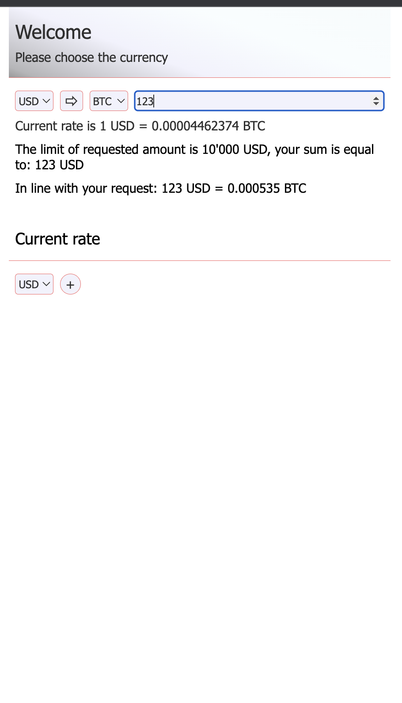
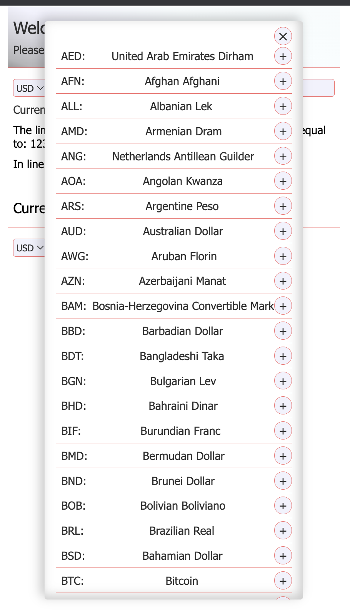

# Currency converter

[demo](https://artemteslenko.github.io/currency-converter/)

## Table of Contents

- [General Info](#general-information)
- [Technologies Used](#technologies-used)
- [Screenshots](#screenshots)
- [Contact](#contact)

## General Information

- A simple currency converter application. The user can switch between different currencies and see the exchange to the latest update.

## Technologies Used

- HTML
- CSS
- JavaScript
- Vue

## Screenshots

-Get converted sum

-Change current reate table list

## Contact

Created by [Artem Teslenko](https://t.me/artemTeslenkoW126) - feel free to contact me!
